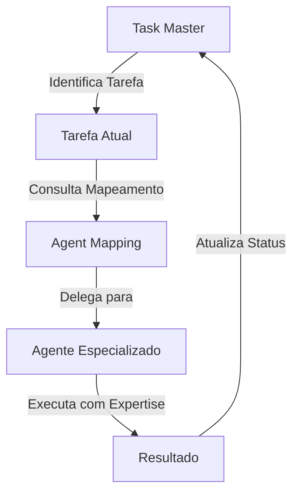

# Integração Task Master + Agentes Especializados

## Como o Task Master Orquestra os Agentes

O Task Master atua como **maestro** coordenando agentes especializados para cada tarefa do projeto SingleClin.

## Fluxo de Trabalho Integrado



## Comandos Task Master com Agentes

### 1. Iniciar trabalho em uma tarefa
```bash
# Task Master identifica próxima tarefa
task-master next

# Visualiza detalhes e agente delegado
task-master show 1

# Marca como em progresso
task-master set-status --id=1 --status=in-progress

# Ativa o agente especializado
/agent monorepo-architect
```

### 2. Durante a implementação
```bash
# Agente trabalha na subtarefa
# Task Master registra progresso
task-master update-subtask --id=1.1 --prompt="Estrutura base criada com npm workspaces"

# Marca subtarefa como concluída
task-master set-status --id=1.1 --status=done
```

### 3. Colaboração entre agentes
```bash
# Para tarefas com múltiplos agentes
# Ex: Task 4 - Autenticação
/agent auth-security-expert  # Agente principal
/agent dotnet-api-expert    # Agente auxiliar quando necessário
```

## Estrutura de Arquivos Atualizada

```
.taskmaster/
├── docs/
│   ├── prd.txt                          # PRD original
│   ├── agent-mapping.md                 # Mapeamento agente-tarefa
│   └── agent-taskmaster-integration.md  # Este arquivo
├── tasks/
│   ├── tasks.json                       # Database de tarefas
│   ├── task_001.txt                     # [monorepo-architect]
│   ├── task_002.txt                     # [dotnet-api-expert]
│   ├── task_003.txt                     # [database-architect]
│   └── ...                              # Cada arquivo com agente delegado
└── scripts/
    └── update-agent-info.js             # Script de atualização
```

## Benefícios da Integração

### Para o Desenvolvedor
- **Orientação Especializada**: Cada tarefa tem um expert dedicado
- **Menos Erros**: Agentes aplicam best practices automaticamente
- **Aprendizado**: Observar padrões de implementação corretos

### Para o Projeto
- **Qualidade Consistente**: Código segue padrões da indústria
- **Velocidade**: Menos retrabalho e correções
- **Manutenibilidade**: Arquitetura bem estruturada

### Para o Task Master
- **Orquestração Eficiente**: Delega para especialistas certos
- **Rastreamento Preciso**: Progresso registrado por contexto
- **Visibilidade**: Status claro de cada componente

## Exemplo Prático: Task 1 (Monorepo)

```bash
# 1. Task Master mostra a tarefa
$ task-master next
Próxima tarefa: 1 - Configurar Estrutura Monorepo
Agente Delegado: @monorepo-architect

# 2. Ativar agente especializado
$ /agent monorepo-architect

# 3. Agente começa trabalho na subtarefa 1.1
"Vou criar a estrutura base do monorepo com npm workspaces..."

# 4. Task Master registra progresso
$ task-master update-subtask --id=1.1 --prompt="package.json configurado com workspaces"

# 5. Marcar como concluído
$ task-master set-status --id=1.1 --status=done
```

## Visualização do Progresso

```bash
# Ver status geral
$ task-master list --status=in-progress

# Ver detalhes de uma tarefa com agente
$ task-master show 2
Task 2: Configurar Backend API com .NET e JWT
Agente Delegado: @dotnet-api-expert
Status: pending
Subtasks: 5 (0 completed)

# Ver complexidade e recomendações
$ task-master complexity-report
```

## Próximos Passos

1. **Começar pelo Task 1**: Estrutura monorepo com `@monorepo-architect`
2. **Seguir dependências**: Task Master guia a ordem correta
3. **Usar agentes apropriados**: Cada tarefa tem seu especialista
4. **Registrar progresso**: Manter Task Master atualizado

## Comandos Rápidos

```bash
# Workflow completo para uma tarefa
task-master next                           # Ver próxima
task-master show <id>                      # Ver detalhes
task-master set-status --id=<id> --status=in-progress
/agent <agent-name>                        # Ativar agente
task-master update-subtask --id=<id> --prompt="..."
task-master set-status --id=<id> --status=done
```

---

*Este documento conecta o Task Master com o sistema de agentes especializados, criando um fluxo de trabalho integrado e eficiente para o desenvolvimento do SingleClin.*