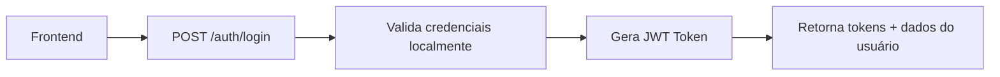
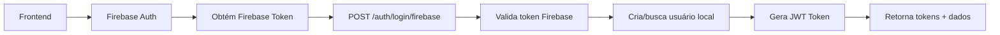

# Guia dos Endpoints de Login - SingleClin API

## Overview

A API SingleClin possui **dois endpoints distintos** para autenticação, cada um com um propósito específico. Este guia explica quando e como usar cada um.

## 📝 Resumo dos Endpoints

| Endpoint | Propósito | Uso Recomendado | Dependência Firebase |
|----------|-----------|-----------------|---------------------|
| `/api/Auth/login` | Login tradicional | Formulários web, admin panel | ❌ Não |
| `/api/Auth/login/firebase` | Login social/móvel | Google/Apple login, apps móveis | ✅ Sim |

---

## 🔐 1. `/api/Auth/login` - Login Tradicional

### **Quando Usar:**
- ✅ Login com email e senha em formulários web
- ✅ Admin panel / dashboard administrativo
- ✅ Aplicações que não precisam de login social
- ✅ Quando Firebase não está configurado

### **Como Funciona:**


### **Request:**
```json
POST /api/Auth/login
{
  "email": "user@example.com",
  "password": "senha123",
  "rememberMe": true,
  "deviceInfo": "Mozilla/5.0..."
}
```

### **Response:**
```json
{
  "accessToken": "eyJhbGciOiJIUzI1NiIs...",
  "refreshToken": "rBmFdSX4R0ZaVcZMtl1g...",
  "expiresIn": 900,
  "userId": "01992e2c-85d6-7bda-b986-4184ba589989",
  "email": "user@example.com",
  "fullName": "Nome Completo",
  "role": 3,
  "clinicId": null,
  "isFirstLogin": false
}
```

### **Vantagens:**
- 🚀 Mais rápido (uma requisição apenas)
- 🛡️ Mais seguro (não expõe tokens Firebase)
- 🔧 Mais simples (não depende de Firebase)
- 💪 Mais confiável (menos pontos de falha)

---

## 🔥 2. `/api/Auth/login/firebase` - Login Social/Móvel

### **Quando Usar:**
- ✅ Login com Google ("Sign in with Google")
- ✅ Login com Apple ("Sign in with Apple")
- ✅ Aplicações móveis que usam Firebase SDK
- ✅ Integração com Firebase Authentication

### **Como Funciona:**


### **Request:**
```json
POST /api/Auth/login/firebase
{
  "firebaseToken": "eyJhbGciOiJSUzI1NiIs...",
  "deviceInfo": "Mozilla/5.0...",
  "rememberMe": true
}
```

### **Response:**
```json
{
  "accessToken": "eyJhbGciOiJIUzI1NiIs...",
  "refreshToken": "rBmFdSX4R0ZaVcZMtl1g...",
  "expiresIn": 900,
  "userId": "01992e2c-85d6-7bda-b986-4184ba589989",
  "email": "user@example.com",
  "fullName": "Nome Completo",
  "role": 1,
  "clinicId": null,
  "isFirstLogin": true
}
```

### **Comportamento Especial:**
- 🆕 **Auto-criação**: Se usuário não existir, cria automaticamente
- 👥 **Role padrão**: Novos usuários recebem role "Patient"
- 🔗 **Sincronização**: Mantém link com Firebase via `FirebaseUid`

---

## ⚠️ **ERRO COMUM - Problema Identificado**

### **❌ O que estava acontecendo (INCORRETO):**
```typescript
// Frontend fazendo fluxo híbrido ERRADO
async login(email: string, password: string) {
  // 1. Autentica com Firebase usando email/senha
  const firebaseResult = await signInWithEmail(email, password)

  // 2. USA TOKEN FIREBASE para login no backend (ERRO!)
  const response = await api.post('/auth/login/firebase', {
    firebaseToken: firebaseResult.token  // ❌ ERRADO!
  })
}
```

### **✅ Correção Implementada (CORRETO):**
```typescript
// Login tradicional direto no backend
async login(email: string, password: string) {
  // Autentica diretamente com o backend
  const response = await api.post('/auth/login', {
    email,
    password,
    rememberMe: true,
    deviceInfo: navigator.userAgent
  })
}
```

---

## 🎯 **Casos de Uso Específicos**

### **Web Admin Panel (Atual)**
```typescript
// ✅ CORRETO - Usar login tradicional
await authService.login(email, password)  // → POST /auth/login
```

### **Google Login Button**
```typescript
// ✅ CORRETO - Usar Firebase login
await authService.loginWithGoogle()  // → POST /auth/login/firebase
```

### **App Mobile (Flutter/React Native)**
```typescript
// ✅ CORRETO - Usar Firebase login
const firebaseToken = await Firebase.auth().currentUser.getIdToken()
await api.post('/auth/login/firebase', { firebaseToken })
```

---

## 📊 **Comparação de Performance**

| Aspecto | `/auth/login` | `/auth/login/firebase` |
|---------|---------------|------------------------|
| **Requisições** | 1 | 2+ (Firebase + Backend) |
| **Latência** | ~200ms | ~500-800ms |
| **Dependências** | Apenas backend | Firebase + Backend |
| **Pontos de falha** | 1 | 2+ |
| **Configuração** | Mínima | Requer Firebase setup |

---

## 🔧 **Configuração Necessária**

### **Para `/auth/login`:**
- ✅ Banco de dados configurado
- ✅ JWT settings no appsettings.json
- ✅ ASP.NET Identity configurado

### **Para `/auth/login/firebase`:**
- ✅ Tudo do `/auth/login` +
- ✅ Firebase project configurado
- ✅ Service account JSON
- ✅ Firebase settings no appsettings.json

---

## 📝 **Resumo e Recomendações**

### **✅ Use `/api/Auth/login` quando:**
- Login tradicional com email/senha
- Admin panels e dashboards
- Aplicações internas
- Não precisa de login social

### **✅ Use `/api/Auth/login/firebase` quando:**
- "Sign in with Google/Apple"
- Apps móveis nativos
- Precisa de Firebase features
- Login social é obrigatório

### **🚨 Nunca faça:**
- ❌ Firebase auth + `/auth/login/firebase` para login tradicional
- ❌ Misturar os dois fluxos desnecessariamente
- ❌ Usar Firebase quando não precisa de suas features

---

## 🏆 **Resultado da Correção**

### **Antes:**
- ❌ 2 requisições para login simples
- ❌ Dependência desnecessária do Firebase
- ❌ Erro de autenticação
- ❌ Maior complexidade

### **Depois:**
- ✅ 1 requisição para login simples
- ✅ Sem dependência Firebase para login básico
- ✅ Login funcionando perfeitamente
- ✅ Código mais simples e confiável

**Login tradicional agora usa o fluxo correto e eficiente! 🎉**